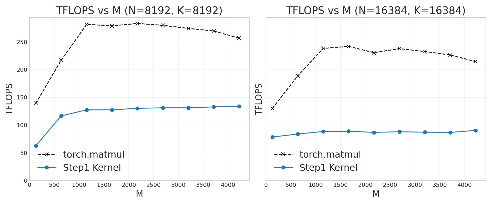
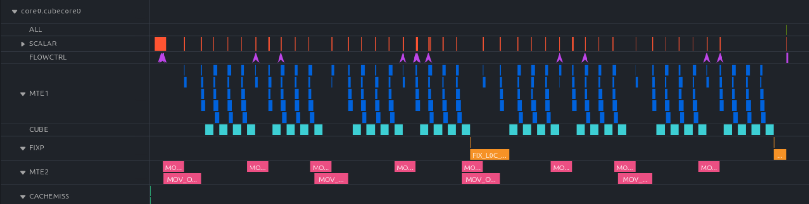
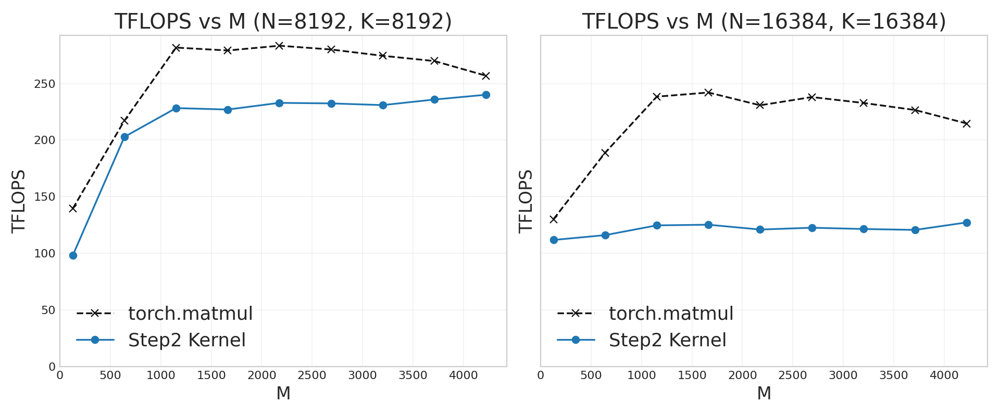
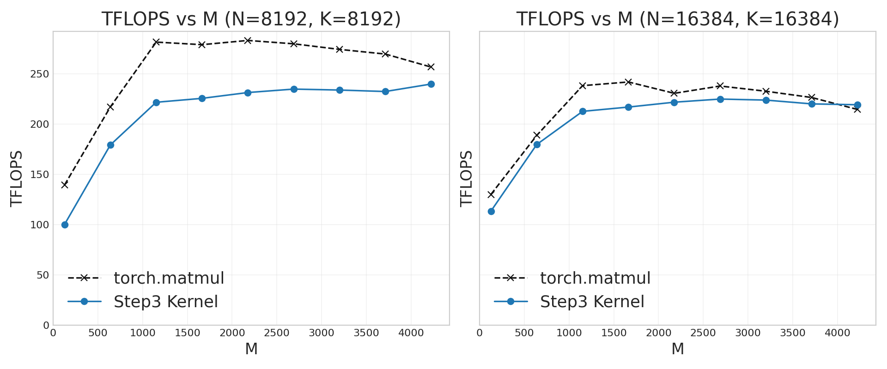
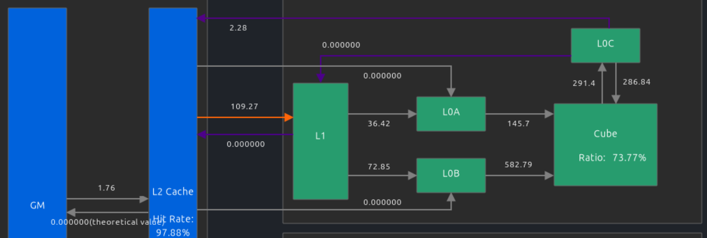
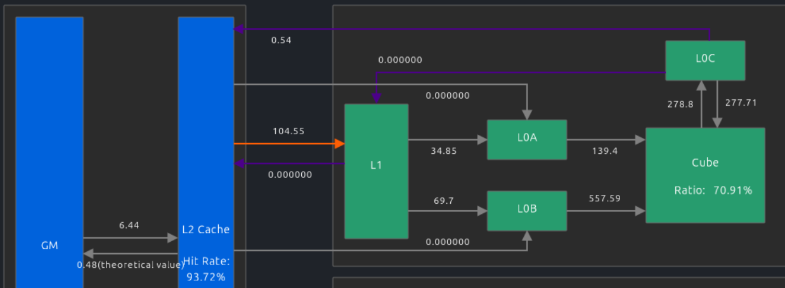
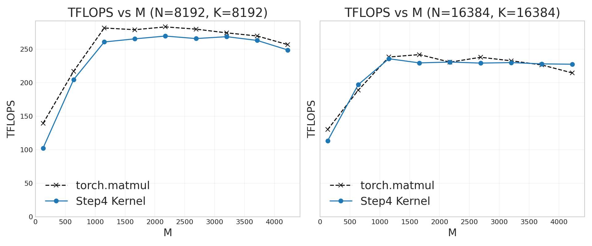

# NPU Matmul kernel from scratch -- reaching CANN library performance using 100 lines of Python <br/>(step-by-step optimization guide using PTO-ISA)

- Date: 2026/03/12
- Author: Jiawei Zhuang
- Contributor: Filip Skogh, Mirko De Vita, Hyun Min Chang

# Outline

- [Motivation](#motivation)
- [Step 0: NPU programming crash course for CUDA/Triton programmers](#step-0-npu-programming-crash-course-for-cudatriton-programmers)
  - [Typical kernel launch syntax](#typical-kernel-launch-syntax)
  - [Auto vs manual software pipelining](#auto-vs-manual-software-pipelining)
- [Step 1: Functionally-correct naive version](#step-1-functionally-correct-naive-version)
- [Step 2: Double buffering](#step-2-double-buffering)
- [Step 3: "Swizzling" for L2 cache reuse](#step-3-swizzling-for-l2-cache-reuse)
- [Step 4: (optional) Manual software pipelining](#step-4-optional-manual-software-pipelining)
- [Appendix A: PTO-DSL syntax note](#appendix-a-pto-dsl-syntax-note)
- [Appendix B: Using NPU profiler](#appendix-b-using-npu-profiler)

**To reproduce all results shown in this guide**, see commands in [README.md](./README.md)

# Motivation

This guide is the NPU version of "step-by-step matmul optimization", a popular article style for NVIDIA GPUs (e.g. [for A100](https://siboehm.com/articles/22/CUDA-MMM) and [for H100](https://cudaforfun.substack.com/p/outperforming-cublas-on-h100-a-worklog)), but never written for our NPUs before.

I intentionally keep the code samples **minimal, hackable, from-scratch, and without magical templates and wrappers**, to make them easier to follow than the more advanced "Matmul optimization practices" [in catlass](https://gitcode.com/cann/catlass/blob/master/docs/contents/advanced/matmul_template_summary.md) or [in AscendC](https://www.hiascend.com/document/detail/zh/canncommercial/850/opdevg/Ascendcopdevg/atlas_ascendc_best_practices_10_10006.html) (which hide optimization tricks behind templates and wrappers).

We will compare our custom kernel's performance to `torch.matmul`, which invokes [aclnnMatmul](https://www.hiascend.com/document/detail/zh/canncommercial/850/API/aolapi/context/ops-nn/aclnnMatmul.md) (our "cuBLAS" for NPU), internally implemented by [many thousands of lines of AscendC](https://gitcode.com/cann/ops-nn/tree/v8.5.0/matmul/mat_mul_v3/op_kernel). We show step-by-step how to match the performance of such a carefully optimized library, using **only ~100 lines of Python DSL**.

# Step 0: NPU programming crash course for CUDA/Triton programmers

(jump to the next section if you have programmed NPU kernels before)

## Typical kernel launch syntax

The [SPMD](https://en.wikipedia.org/wiki/Single_program,_multiple_data)-style kernels on NPU look **deceptively similar** to CUDA/Triton kernel syntax:
- The `block_idx` and `block_num` built-in variables assist offset calculations for each core -- [example here](https://github.com/huawei-csl/pto-dsl/blob/7f8176a648c7c4ca03b09bd75f8b615d4bac0eaf/examples/jit/add_dynamic_multicore/run_add.py#L46-L51)
- The CUDA-style `kernel_name<<<block_dim>>>(args)` kernel launch -- [example here](https://github.com/huawei-csl/pto-dsl/blob/7f8176a648c7c4ca03b09bd75f8b615d4bac0eaf/examples/aot/add_dynamic_multicore/caller.cpp#L11)

However, there is an important difference: all NPU kernels are ["persistent kernels"](https://triton-lang.org/main/getting-started/tutorials/09-persistent-matmul.html) in CUDA terminology, i.e. the `block_dim` is forced to be the number of cores instead of growing with the input data size.

Check this [PTO dynamic-shape vector-add example](https://github.com/huawei-csl/pto-dsl/blob/d923ac2ed3c1a2180475c1d279699ea952022e77/examples/jit/add_dynamic_multicore/run_add.py#L46-L100) -- each core calculates its own global memory offsets, and the required number of iterations [depends dynamically on the input data size](https://github.com/huawei-csl/pto-dsl/blob/d923ac2ed3c1a2180475c1d279699ea952022e77/examples/jit/add_dynamic_multicore/run_add.py#L83). This is **unlike** conventional ("non-persistent") CUDA/Triton kernels, where a data-dependent `block_dim` handles the dynamic input size. For example, unlike [Triton vector add](https://triton-lang.org/main/getting-started/tutorials/01-vector-add.html#compute-kernel) that sets `grid = (ceil_div(n_elements, BLOCK_SIZE),)`, most of our NPU kernels (no matter whether they are written in PTO, AscendC, CCE, or other frameworks) always have `grid = (num_cores,)`.

(A data-dependent large `block_dim` *might* work for simple cases on NPU, but it can often hit bugs during Cube-Vector synchronization, and can also overflow if `block_dim >= 65536` -- a bug [that we fixed](https://github.com/huawei-csl/pto-kernels/pull/39) by switching to persistent-kernel style.)

## Auto vs manual software pipelining

Our NPU uses on-chip [scratchpad memory](https://en.wikipedia.org/wiki/Scratchpad_memory) instead of hardware-managed cache, so [data hazards](https://en.wikipedia.org/wiki/Hazard_(computer_architecture)#Data_hazards) must be avoided by the programmer or software using [set_flag & wait_flag APIs](https://www.hiascend.com/document/detail/zh/CANNCommunityEdition/850/API/cceintrinsicapi/cceapi_0106.html), essentially a [binary-semaphore](https://en.wikipedia.org/wiki/Semaphore_(programming)#Producer%E2%80%93consumer_problem) synchronization mechanism. The closest analogy in CUDA is [all the `cp.async` stuff](https://docs.nvidia.com/cuda/cuda-programming-guide/04-special-topics/async-copies.html) that needs manual waits. See this [manually synchronized vector-add example](https://github.com/PTO-ISA/pto-isa/blob/5de2d24d53e8cf39dec5fc11f997d1e74fa7190c/demos/torch_jit/add/add_custom.cpp#L78-L115). For complex fused kernels like [FlashAttention](https://github.com/PTO-ISA/pto-isa/tree/5de2d24d53e8cf39dec5fc11f997d1e74fa7190c/kernels/manual/common/flash_atten), it can be hard to reason about manual synchronization, software pipelining, and prefetching.

To solve this headache, [PTO-DSL](https://github.com/huawei-csl/pto-dsl) offers automatic synchronization, internally achieved by the [InsertSync](https://github.com/zhangstevenunity/PTOAS/tree/8eb9e23fa95e18c3db789e0a171a98df07a8a846/lib/PTO/Transforms/InsertSync) compile pass based on the [PTO MLIR dialect](https://github.com/zhangstevenunity/PTOAS/blob/8eb9e23fa95e18c3db789e0a171a98df07a8a846/docs/PTO_IR_manual.md). The kernel code still looks "sequential" (in the pipelining dimension), similar to writing Triton or CuTile code.

# Step 1: Functionally-correct naive version

According to our [NPU hardware architecture](https://www.hiascend.com/document/detail/zh/CANNCommunityEdition/850/opdevg/Ascendcopdevg/atlas_ascendc_10_0008.html), a matmul operation requires this movement across the memory hierarchy:
- `GM` (global memory) -> `L1` -> `L0` (`L0A` or `L0B` for left or right operands) -> `Cube core` -> `L0C` -> `GM`

The on-chip tile size (an algorithm parameter) is bounded by the L1/L0 SRAM size constraint (a hardware parameter). The [NPU hardware spec](https://www.hiascend.com/document/detail/zh/CANNCommunityEdition/850/opdevg/Ascendcopdevg/atlas_ascendc_10_0011.html) can be found in files `${ASCEND_HOME_PATH}/arm64-linux/data/platform_config/*.ini` in any CANN-installed environment:

```bash
grep -A 9 "AICoreSpec" ${ASCEND_HOME_PATH}/arm64-linux/data/platform_config/Ascend910B2.ini
```

gives:

```
[AICoreSpec]
...
l0_a_size=65536  # 64 KiB
l0_b_size=65536  # 64 KiB
l0_c_size=131072  # 128 KiB
l1_size=524288  # 512 KiB
```

Consider the classic [tiled matrix multiplication](https://en.wikipedia.org/wiki/Loop_nest_optimization#Example:_matrix_multiplication) -- a general-shape matmul `C = A @ B` is implemented by tile-level operations over `A_tile = A[i1:i2,k1:k2]`, `B_tile = B[k1:k2,j1:j2]`, `C_tile = C[i1:i2,j1:j2]`, so that each tile fits into SRAM. Given the above SRAM info, we choose the tile sizes as:
- `[128 x 512]` for `A_tile` on `L1`, taking 128 KiB (fp16)
- `[256 x 256]` for `B_tile` on `L1`, taking 128 KiB (fp16)
- `[128 x 64]` for `A_tile` on `L0A`, taking 16 KiB (fp16)
- `[64 x 256]` for `B_tile` on `L0B`, taking 32 KiB (fp16)
- `[128 x 256]` for `C_tile` on `L0C`, taking 128 KiB (fp32 accumulation)
- The Cube unit performs the [`TMATMUL`](https://github.com/PTO-ISA/pto-isa/blob/5de2d24d53e8cf39dec5fc11f997d1e74fa7190c/docs/isa/TMATMUL.md) instruction of size `(M, N, K) = (128, 256, 64)`, taking `L0A` and `L0B` as input and `L0C` as output.

Why choose these tile sizes:
- This is a common tiling choice [in the ATB library's matmul](https://gitcode.com/cann/ascend-transformer-boost/blob/br_release_cann_8.5.0_20260527/src/kernels/kernels/matmul/pp_matmul_f16_kernel/op_kernel/pp_matmul.cce?init=initTree), but many other choices also work as long as they fit into the buffers.
- The Cube unit prefers larger tile sizes for higher FLOPs utilization. For example, 128 x 128 typically achieves higher FLOPs than 32 x 32. For the full set of supported matmul shapes and dtypes, see the [`Mmad` instruction](https://www.hiascend.com/document/detail/zh/CANNCommunityEdition/850/API/ascendcopapi/atlasascendc_api_07_0249.html).
- We still have >=50% space left for `L1`, `L0A`, `L0B`. They are reserved for double-buffering later.

See [step1_baseline_numpy_sim.py](./step1_baseline_numpy_sim.py) for the full "NumPy emulation code" that explains the algorithm logic. It's the most basic "split-MN matmul", where each core outputs its own `C_tile = C[i1:i2,j1:j2]`. We leave Split-K and Stream-K matmuls for future posts. The key code components are:
- The top-level loop `for li in range(core_loop):` comes from our "persistent kernel" requirement explained in [Typical kernel launch syntax](#typical-kernel-launch-syntax). Instead of having two-level "row and column loops", we bundle them together into a single-level `core_loop = n_loop * m_loop`, where each iteration can be independently assigned to a different core and completes its own `C_tile` calculation.
- Then we only need to accumulate over the inner K-dimension:
    - The second-level loop `for k_idx in range(k_dtile_num)` is for "GM - L1 level" iterations. Once the current tile on `L1` is fully consumed by matmul and no longer needed, we load the next tile from `GM`.
    - The third-level loop `for phase in range(8):` is for "L1 - L0 level" iterations. Once the current tile on `L0` is fully consumed by matmul and no longer needed, we load the next tile from `L1`.
    - Notice that the third-level loop can be **statically unrolled** because we have a fixed ratio between `L1` and `L0` tile sizes. Because `L0` tiles are smaller than `L1` tiles, more than one "L0-level iteration" is required to match each "L1-level iteration".

Then, we translate this NumPy emulation code into equivalent PTO-DSL code in [step1_baseline.py](./step1_baseline.py) and [common_utils.py](./common_utils.py). The PTO code logic largely follows the NumPy emulation, while using NPU-specific data movement and compute APIs:
- Use `pto.load` ([TLOAD](https://github.com/PTO-ISA/pto-isa/blob/5de2d24d53e8cf39dec5fc11f997d1e74fa7190c/docs/isa/TLOAD.md)) for `GM`->`L1` load
- Use `tile.extract` ([TEXTRACT](https://github.com/PTO-ISA/pto-isa/blob/5de2d24d53e8cf39dec5fc11f997d1e74fa7190c/docs/isa/TEXTRACT.md)) for `L1`->`L0A`, `L1`->`L0B` loads
- Use `tile.matmul`/`tile.matmul_acc` ([TMATMUL](https://github.com/PTO-ISA/pto-isa/blob/5de2d24d53e8cf39dec5fc11f997d1e74fa7190c/docs/isa/TMATMUL.md)/[TMATMUL_ACC](https://github.com/PTO-ISA/pto-isa/blob/5de2d24d53e8cf39dec5fc11f997d1e74fa7190c/docs/isa/TMATMUL_ACC.md)) for compute on `L0`
- Use `pto.store` ([TSTORE](https://github.com/PTO-ISA/pto-isa/blob/5de2d24d53e8cf39dec5fc11f997d1e74fa7190c/docs/isa/TSTORE.md)) for `L0C`->`GM` store
- Use native Python `for i in range()` for statically unrolled loop, and `for i in pto.range()` for run-time dynamic loop. Similarly for `if`/`else` branching.

More DSL-specific syntax details are explained in [Appendix A: PTO-DSL syntax note](#appendix-a-pto-dsl-syntax-note).

This simple 80-line PTO kernel produces numerically correct results on NPU, but the performance is only 50% of the `torch.matmul` reference. We will close the gap in the next section.



# Step 2: Double buffering

Profiling our previous kernel with `msprof op simulator`:

```bash
msprof op simulator --aic-metrics=PipeUtilization \
    --kernel-name="_Z28matmul_kernel_step1_baselinePDhS_S_iii_mix_aic" \
    --output="msprof_res" --launch-count=5 \
    python ./run_matmul.py --variant step1-baseline
```

(see [Appendix B: Using NPU profiler](#appendix-b-using-npu-profiler) for more profiler usage details)

We see that the Cube core is idle for 50% of the time:



Double buffering overlaps compute and data transfer:


See full code in [./step2_doublebuffer.py](./step2_doublebuffer.py).

Profile with:

```bash
msprof op simulator --aic-metrics=PipeUtilization \
    --kernel-name="_Z26matmul_kernel_ABt_autosyncPDhS_S_iii_mix_aic" \
    --output="msprof_res" --launch-count=5 \
    python ./run_matmul.py --variant step2-doublebuffer
```

The only difference is that we allocate 2x local buffers for A and B on both `L1` and `L0`:

```python
a_l1 = [pto.alloc_tile(tile_buf_a_l1), pto.alloc_tile(tile_buf_a_l1)]
b_l1 = [pto.alloc_tile(tile_buf_b_l1), pto.alloc_tile(tile_buf_b_l1)]
a_l0 = [pto.alloc_tile(tile_buf_a_l0), pto.alloc_tile(tile_buf_a_l0)]
b_l0 = [pto.alloc_tile(tile_buf_b_l0), pto.alloc_tile(tile_buf_b_l0)]
```

and alternate between the "odd" and "even" buffers across iterations.

Now the FLOPs are doubled for not-so-large matrices:


For large-enough matrices such as 16384x16384, the FLOPs **suddenly drop** because the NPU L2 cache is not large enough to hold the entire matrix, and the data gets evicted from cache.

We can check the L2 cache size with:

```bash
grep -A 8 "SoCInfo" ${ASCEND_HOME_PATH}/arm64-linux/data/platform_config/Ascend910B2.ini
```

gives:

```
[SoCInfo]
ai_core_cnt=24
cube_core_cnt=24
vector_core_cnt=48
ai_cpu_cnt=6
memory_type=
memory_size=68719476736  # 64 GiB
l2_type=0
l2_size=201326592  # 192 MiB
```

An 8192x8192 matrix (64 MiB in float16) is smaller than L2, but a 16384x16384 matrix (256 MiB in float16) is larger than L2, so we see worse performance.

For `910B4`, both HBM size and L2 cache size are smaller by half (thus the cache eviction effect happens for smaller matrices):

```bash
grep -A 8 "SoCInfo" ${ASCEND_HOME_PATH}/arm64-linux/data/platform_config/Ascend910B4.ini
```

```
[SoCInfo]
ai_core_cnt=20
cube_core_cnt=20
vector_core_cnt=40
ai_cpu_cnt=6
memory_type=
memory_size=34359738368  # 32 GiB
l2_type=0
l2_size=100663296  # 96 MiB
```

# Step 3: "Swizzling" for L2 cache reuse

Swizzling improves L2 cache reuse across multiple cores. We borrow this figure [from Triton matmul](https://triton-lang.org/main/getting-started/tutorials/03-matrix-multiplication.html#l2-cache-optimizations):


To read this figure, assume 9 cores computing a subset `C` matrix in the first iteration (the yellow area, each number 0 ~ 8 marks the core id). In the naive "row-major ordering", the full matrix B (assume larger than L2 cache!) needs to be loaded from global memory; while in the "grouped ordering", the data traffic w.r.t. global memory is much less. 

[step3_swizzle.py](./step3_swizzle.py) incorporates a 10-line swizzling function `swizzle_nz`, while keeping the rest of the code same as step2. [step3_swizzle_numpy_sim.py](./step3_swizzle_numpy_sim.py) explains the swizzle scheme intuitively. The swizzle algorithm is one of the algorithms [from catlass](https://gitcode.com/cann/catlass/blob/v1.4.0/include/catlass/gemm/block/block_swizzle.hpp), which also [has a nice explanation](https://gitcode.com/cann/catlass/blob/v1.4.0/docs/contents/advanced/swizzle_explanation.md)
(for GPU experts -- such index remapping is analogous to [the "scheduler" in DeepGEMM](https://github.com/deepseek-ai/DeepGEMM/blob/v2.1.1/deep_gemm/include/deep_gemm/common/scheduler.cuh), which alters data assignment and loop order for each SM)

With just this 10-line swizzle function, the FLOPs are much improved, reaching ~90% of `torch.matmul`!



To confirm the L2 cache effect, profile cache hit with `msprof op`:

```bash
msprof op \
    --aic-metrics=Occupancy,Roofline,Default,L2Cache,PipeUtilization,MemoryL0 \
    --kernel-name="_Z26matmul_kernel_ABt_autosyncPDhS_S_iii_mix_aic" \
    --output="msprof_res" --launch-count=5 \
    python ./run_matmul.py --variant step3-swizzle
```

For a small 4096x4096 matrix, L2 cache hit is high (97.88%) even without a swizzled loop order:
 


For a larger 16384x16384 matrix that exceeds L2, L2 cache hit is low (30.9%) without swizzling:


With swizzling, the 16384x16384 case now gets a high (93.72%) L2 hit rate:




# Step 4: (optional) Manual software pipelining

The last 10% performance gap can be squeezed out by manual software pipelining in [./step4_manual_pipelining.py](./step4_manual_pipelining.py).



Even with manual sync, the code only increases from ~100 lines to ~150 lines of Python, still much shorter than library code. How to manually arrange the sync flags is out of scope for this guide. We are [investigating the compile pass](https://github.com/zhangstevenunity/PTOAS/issues/226) so that compiler-inserted sync can eventually reach manual performance.

# Appendix A: PTO-DSL syntax note

The current [PTO-DSL package](https://github.com/huawei-csl/pto-dsl/tree/3f0860b1e750f2c4d26a93c6501a212b60196863/ptodsl) is just a very thin wrapper over the [MLIR Python bindings](https://mlir.llvm.org/docs/Bindings/Python/) of PTO dialect. The entire package has **only ~1000 lines of Python** (you can check by `cd ptodsl && find . -name "*.py" | xargs wc -l`).

To keep the framework simple during rapid development, we are NOT using Python AST parsing or AST rewriting. Thus, all Python-native constructs (`if`/`for` control flows, Python classes, iterators, etc.) execute like normal Python code. This is unlike other pure-AST (the case for Triton & CuTile) or hybrid AST+tracing (the case for Tilelang & CuteDSL) frontends that *might or might not* rewrite native `if`/`range` as special IR builders (e.g. see the [complex rules for CuteDSL](https://github.com/Dao-AILab/quack/blob/v0.3.2/docs/dsl_control_flow.rst)). The current PTO-DSL frontend is pure Python tracing, most like JAX's approach.

**Users should keep in mind:** run-time dynamic control flows are only available in the `pto` namespace such as `pto.range` (which creates [MLIR structured control flow](https://mlir.llvm.org/docs/Dialects/SCFDialect/) in the IR module), while Python native control flows are evaluated at build time.

Common cases:

- **Python `for ... in range(...)`**
  - runs before generating the IR (build-time)
  - usually acts like compile-time metaprogramming/unrolling
- **`for ... in pto.range(...)`**
  - emits an MLIR `scf.for` loop
  - executes dynamically at kernel run-time
- **Python `if condition:`**
  - condition evaluated at build-time by Python
  - branch is selected before generating IR
- **`with pto.if_context(cond):` / `pto.cond(...)`**
  - emits runtime `scf.if`
  - condition is evaluated when kernel runs

**Example 1: `pto.range` (runtime loop in IR)**

From `step1_baseline.py`:

```python
for li in pto.range(bid, core_loop, num_blocks):
    ...
```

This is **not** Python iteration over integers. In PTO-DSL, `pto.range` is an IR-builder primitive (see `control_flow.py`) that constructs `scf.ForOp` and yields an induction-variable value.

Practical effect:
- loop trip count depends on runtime values like `bid`, `core_loop`, `num_blocks`
- loop stays as a loop in generated IR (not unrolled by Python)

**Example 2: Python `range` (build-time unrolling)**

From `step1_baseline.py`:

```python
for phase in range(8):
    ...
```

This loop is executed by Python while building IR, so it typically creates 8 repeated code regions in IR.

For readers with C++ background:
- this is conceptually similar to compile-time code generation / metaprogramming
- useful when loop bounds are small constants

**Example 3: Python `if` vs `pto.if_context`**

From `step1_baseline.py`:

```python
if phase == 0:
    with pto.if_context(is_first_k_tile, has_else=True) as branch:
        tile.matmul(a_l0, b_l0, c_l0)
    with branch.else_context():
        tile.matmul_acc(c_l0, a_l0, b_l0, c_l0)
else:
    tile.matmul_acc(c_l0, a_l0, b_l0, c_l0)
```

How to read this correctly:
- `if phase == 0` is a **Python** branch (build-time), because `phase` is a Python integer from `range(8)`.
- `pto.if_context(is_first_k_tile, ...)` emits a **runtime** branch in IR, because `is_first_k_tile` is a kernel scalar value.

In plain words:
- first, Python decides which code shape to generate for each unrolled `phase`
- inside that shape, PTO-DSL inserts dynamic control flow for runtime conditions

# Appendix B: Using NPU profiler

How to find the kernel name for the `--kernel-name=` argument: first run `msprof op` without `--kernel-name=`, then it will print the kernel name.

See the [full official doc for msProf](https://www.hiascend.com/document/detail/zh/canncommercial/850/devaids/optool/atlasopdev_16_0082.html).

For the UI to inspect profiler traces, download with:

```bash
# Windows x86
wget https://ascend-repo.obs.cn-east-2.myhuaweicloud.com/MindStudio/MindStudio%208.3.0/MindStudio-Insight_8.3.0_win.exe

# Mac arm and x86
wget https://ascend-repo.obs.cn-east-2.myhuaweicloud.com/MindStudio/MindStudio%208.3.0/MindStudio-Insight_8.3.0_darwin-aarch64.dmg
wget https://ascend-repo.obs.cn-east-2.myhuaweicloud.com/MindStudio/MindStudio%208.3.0/MindStudio-Insight_8.3.0_darwin-x86_64.dmg

# Linux arm and x86
wget https://ascend-repo.obs.cn-east-2.myhuaweicloud.com/MindStudio/MindStudio%208.3.0/MindStudio-Insight_8.3.0_linux-aarch64.zip
wget https://ascend-repo.obs.cn-east-2.myhuaweicloud.com/MindStudio/MindStudio%208.3.0/MindStudio-Insight_8.3.0_linux-x86_64.zip
```

Those links are obtained from [this CANN download page](https://www.hiascend.com/developer/download/community/result?module=sto).
